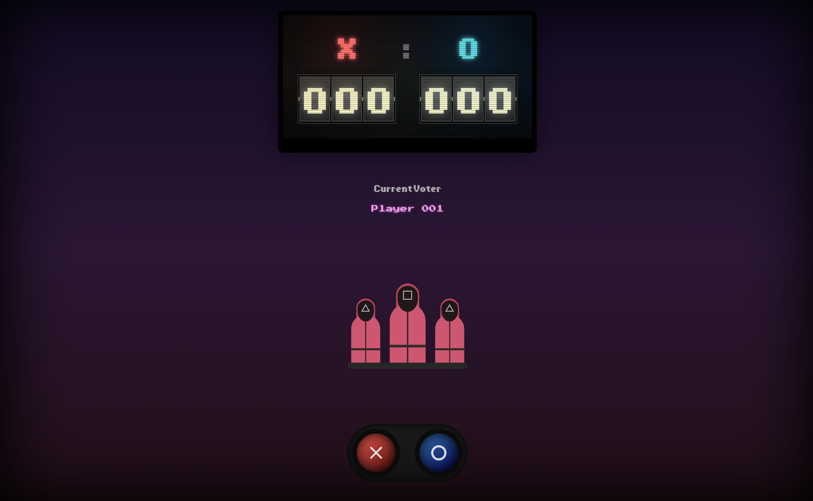

# ⏺️🔼⏹️ Squid Game Vote

[DEMO](https://squidgamevote.netlify.app)


This is an amazing Squid Game Style voting app. This Squid Game-themed voting app is a thrilling, immersive experience designed to capture the suspense and drama of the series while incorporating interactive decision-making for users. Here’s a detailed walkthrough of how it works:

## Technologies Used

- React
- Node.js

## Screenshots



## Contact

For any inquiries or feedback, please contact us at [rinogodson@gmail.com](mailto:rinogodson@gmail.com).

## Table of Contents

- [Installation](#installation)
- [Usage](#usage)
- [Contributing](#contributing)
- [License](#license)

## Installation

Instructions on how to install and set up the project.

```bash
# Clone the repository
git clone https://github.com/yourusername/projectname.git

# Navigate to the project directory
cd projectname

# Install dependencies
npm install
```

## Usage
[You can get a tutorial here.](https://youtu.be/kdo46eMNcTM).

```bash
# Start the development server
npm run dev
```

## Contributing

Guidelines for contributing to the project.

1. Fork the repository.
2. Create a new branch (`git checkout -b feature-branch`).
3. Make your changes.
4. Commit your changes (`git commit -m 'Add some feature'`).
5. Push to the branch (`git push origin feature-branch`).
6. Open a pull request.

## License

This project is licensed under the MIT License - see the [LICENSE](LICENSE) file for details.